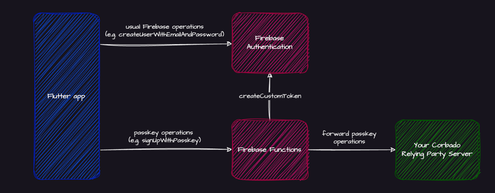

# Corbado Auth Firebase for Flutter

A Flutter package that allows you to make use of passkeys together with Firebase.
This package should be used in addition to [firebase_auth](https://pub.dev/packages/firebase_auth).
It can be used to add passkeys support to an existing Firebase project (with already existing users)
or to create a completely new project.
As a relying party server solution this package makes use of [Corabdo](app.corbado.com).

If you want to understand how this package can be used in your app, take a look at this package's example.

|             | Android | iOS | Linux | macOS | Web        | Windows |
|-------------|---------|-----|-------|-------|------------|---------|
| **Support** | yes     | yes | no    | no    | not tested | no      |

## Features

* allow new users to sign up and log in using passkeys 
* allow existing users (that you created with Firebase authentication) to setup a passkey and then log in with it
* emailOTP codes as fallback mechanism for situations when passkeys can not be used (e.g. when a user logs in to a device where none of his passkeys is available)

## Architecture

The following picture shows the four important parts of our system:

### Flutter app
This is your Flutter app.
It must make use of firebase_auth for authentication. 
You now want to add this package as a dependency to your app.
If you don't make use of Firebase for authentication, this package is not for you (if you still want to make use of passkeys you might want to take a look at [corbado_auth](https://pub.dev/packages/corbado_auth) though).

### Firebase Authentication
This is a backend provided by Firebase.
You configure it using the Firebase console (just as you are used to) to enable different types of authentication. 
For this package to work you don't need to change anything specific here.

### Firebase Functions
The flutter code of this package will call a number of Firebase functions.
These functions must be deployed to your Firebase project.
You don't have to manage them manually though.
This package comes with a Firebase extension that will automatically deploy the required functions to your Firebase project.

So you might ask, why do we need Firebase functions?
These functions act as a bridge between Firebase auth and Corbado.
To achieve this they will generate a custom firebase token after a user has successfully logged in using a passkey.
When returned to the Flutter app, this token is than used by this package to sign in to Firebase auth.
From this point on you can use all other types of Firebase's service (Firebase, Storage, ...).
These tokens can only be generated using the Firebase Admin SDK (and this must only be used in a backend environment).

### Relying Party Server 
For passkey authentication to work, you need a relying party server.
In a nutshell this server is responsible for keeping the public keys of all user passkeys and it emits and validates challenges when users want to log in using a passkey.
As the Firebase functions do not hold any state about the passkeys they will call this relying party server for all passkey related operations.
We are using Corbado as a relying party server so that you don't have to set up one yourself.

## Preparations and configuration

For this package to work you need to do two things:
- deploy this package's firebase extension to your Firebase project
- add this package to your Flutter app and configure it
- configure your Corbado project

We will now describe these steps in more detail.

### Deploy the Firebase extension
1. Go to the [Firebase extension hub](https://extensions.dev/extensions/firebase/functions-corbado-auth) and install the extension by clicking on "Install in Firebase console". Make sure that you select the correct Firebase project (the one you want to use with your Flutter app).
2. After the installation you have to append the "Service Account Token Creator" to your service account. This is required so that the extension can generate custom firebase tokens. To do this, follow the instructions in the POSTINSTALL.md.

### Add this package to your Flutter app
1. Add this package to your Flutter app by adding it to your pubspec.yaml.
2. Create an instance of CorbadoAuthFirebase and initialize it (see this package's example to get a better understanding about how this works).

### Configure your Corbado project

Normally, when you introduce passkeys to any type of app, you need to set up a relying party server.
Luckily, you don't have to do this on your own, Corbado takes care of this for you.
You need to make a few configurations though. 
The goal behind them is to establish trust between your app and the relying party server. 
So in a nutshell you need to tell the relying party server that your app is allowed to use it and you need to tell your app that it can trust the relying party server.
These configurations are not specific to this package so we just link to the relevant sections in the [corbado_auth](https://pub.dev/packages/corbado_auth) package.

#### iOS
https://github.com/corbado/flutter-passkeys/blob/main/packages/corbado_auth/README.md#ios

#### Android
https://github.com/corbado/flutter-passkeys/blob/main/packages/corbado_auth/README.md#android
